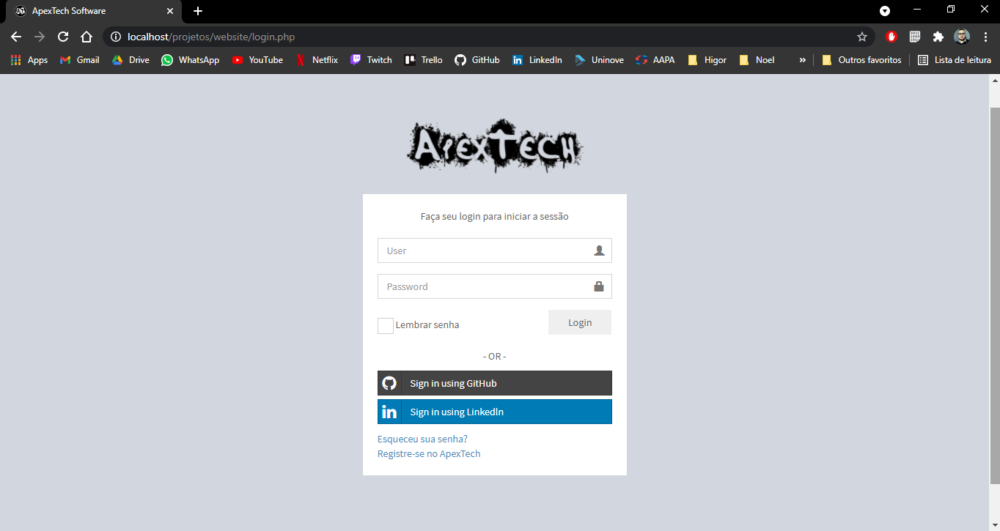
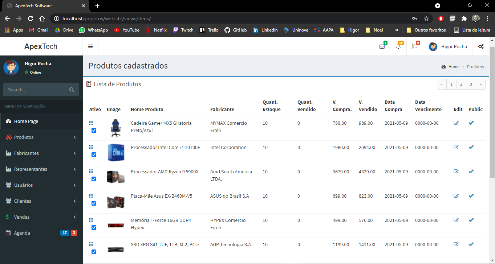
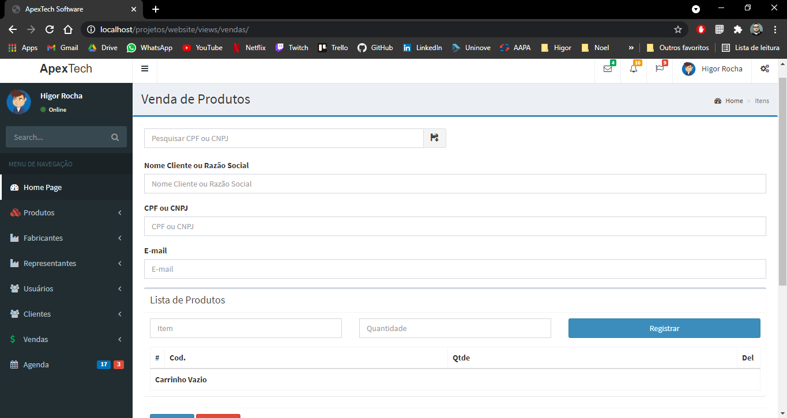

<h1 align="center">
    
</h1>

  <a href="#-funcionalidades">Funcionalidades</a>&nbsp;&nbsp;&nbsp;|&nbsp;&nbsp;&nbsp;
  <a href="#-tecnologias">Tecnologias</a>&nbsp;&nbsp;&nbsp;|&nbsp;&nbsp;&nbsp;
  <a href="#-estrutura">Estrutura</a>&nbsp;&nbsp;&nbsp;|&nbsp;&nbsp;&nbsp;
  <a href="#-layout">Layout</a>&nbsp;&nbsp;&nbsp;|&nbsp;&nbsp;&nbsp;
  <a href="memo-licença">Licença</a>&nbsp;&nbsp;&nbsp;|&nbsp;&nbsp;&nbsp;
  <a href="speech_balloon-contatos">Contatos</a>

 

  

  Projeto desenvolvido e atrelado com a disciplina de "Projeto Prático em Construção de Sistemas" da UNINOVE, onde o mesmo tem por seu objetivo organizar e controlar o estoque     de um respectivo estabelecimento. 

 

## 🚀 Tecnologias
Esse projeto foi desenvolvido com as seguintes tecnologias:

- `Frontend`  
           
           

- `Backend` 

- `Biblioteca` 

- `Banco de Dados` 

- `Ferramentas` 
              
              
- `Versionamento` 
                

## 🛠 Funcionalidades
- `Cadastrar Usuários` | Realizar o Cadastro do usuário com Nome, Email, Senha e Foto do perfil;
- `Ativar/Desativar Usuários` | Realizar a ativação ou desativação do usuário no acesso ao sistema;
- `Cadastrar Produtos` | Realizar o Cadastro de Produtos com Nome, Fabricante, Quantidade, Valor de Compra e Venda;
- `Alterar Produtos` | Realizar a Alteração de dados do produto cadastrado;
- `Ativar/Desativar Produtos` | Realizar a ativação ou desativação de um produto, caso o mesmo tenha se tornado obsoleto;
- `Cadastrar Fabricantes` | Realizar o Cadastro de Fabricantes dos produtos com Nome/Razão Social, CPF/CNPJ e email;
- `Cadastrar Representantes` | Realizar o Cadastro de Representantes dos fabricantes com Nome e Email;
- `Registrar Venda` | Realizar o registro de uma venda e automaticamente atualizado a quantidade no estoque;

## 🔗 Estrutura
A estrutura de arquivos deste projeto se encontra da seguinte maneira:

## 💻 Layout
Você pode visualizar o layout básico do projeto através [desse link](https://drive.google.com/drive/folders/1MTBgjYxiI5z4GsS7MLQ7EoeI76opLBsr?usp=sharing). Lembrando que não é necessáario ter uma conta no Google Drive para acessá-lo.
(imagens com baixa resolução, o vídeo presente na pasta tem um melhor resultado e demonstração). 

<!--
<h1 align="center">
    
    
    
</h1>
-->

## :memo: Licença
Esse projeto está sob a licença Apache 2.0. Veja o arquivo [LICENSE](LICENSE.md) para maiores detalhes.

## :speech_balloon: Contatos
&nbsp;
&nbsp;
