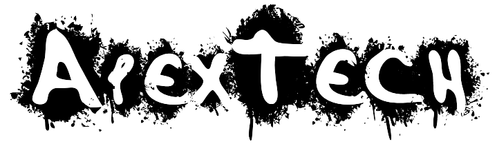

<h1 align="center">
    
</h1>

<p align="center">
  <a href="#-funcionalidades">Funcionalidades</a>&nbsp;&nbsp;&nbsp;|&nbsp;&nbsp;&nbsp;
  <a href="#-tecnologias">Tecnologias</a>&nbsp;&nbsp;&nbsp;|&nbsp;&nbsp;&nbsp;
  <a href="#-layout">Layout</a>&nbsp;&nbsp;&nbsp;|&nbsp;&nbsp;&nbsp;
  <a href="memo-licença">Licença</a>&nbsp;&nbsp;&nbsp;|&nbsp;&nbsp;&nbsp;
  <a href="speech_balloon-contatos">Contatos</a>
</p>

<p align="center">
 

  
</p>

<p align="center">
  Projeto desenvolvido e atrelado com a disciplina de "Projeto Prático em Construção de Sistemas" da UNINOVE, onde o mesmo tem por seu objetivo organizar e controlar o estoque     de um respectivo estabelecimento, contando com as seguintes funções:
</p>

<br/>

## 🚀 Funcionalidades
- Cadastrar Usuário (Administrador e Vendedor);
- Ativar/Desativar Funcionário;
- Cadastrar Produtos;
- Alterar Produtos;
- Ativar/Desativar Produtos;
- Cadastrar Fabricantes;
- Registrar saídas do estoque (vendas);


## 🚀 Tecnologias
Esse projeto foi desenvolvido com as seguintes tecnologias:

&nbsp;
&nbsp;
&nbsp;
&nbsp; 
&nbsp;
&nbsp; 
&nbsp;


## 🚀 Tecnologias
A estrutura de arquivos está da seguinte maneira:

```bash
rocketseat-basic
├── src/
│   ├── config/
│   │   └── ReactotronConfig.js
│   ├── images/
│   │   ├── rocketseat_logo_roxa.png
│   │   └── rocketseat_logo.png
│   ├── pages/
│   │   └── Main/
│   │       └── index.js
│   ├── services/
│   │   └── api.js
│   ├── index.js
│   └── routes.js
├── .editorconfig
├── .eslintrc.json
├── .gitignore
├── babel.config.js
├── dependencies.json
├── devDependencies.json
├── index.js
├── jsconfig.js
├── LICENSE
├── package.json
└── README.md
```

## 🚀 Layout
Esse projeto foi desenvolvido com as seguintes tecnologias:


## :memo: Licença
Esse projeto está sob a licença Apache 2.0. Veja o arquivo [LICENSE](LICENSE.md) para maiores detalhes.


## :speech_balloon: Contatos
[](https://instagram.com/hiigorrocha_)&nbsp;
[](https://www.linkedin.com/in/higor-silva18/)&nbsp;
